# Connect SQL Developer to Oracle Cloud Infrastructure VM Database
## Before You Begin

This 15-minute tutorial walks you through the steps to connect Oracle SQL Developer to an Oracle Database running in an Oracle Cloud Infrastructure Virtual Machine.

### Background
Oracle Cloud Infrastructure provides a quick and easy to create an Oracle Database 19c instance running in a Virtual Machine. Oracle SQL Developer is a free, integrated development environment that simplifies the development and management of Oracle Database in both traditional and Cloud deployments.

### What Do You Need?

* An Oracle Cloud paid account or free trial. To sign up for a trial account with $300 in credits for 30 days, click [here](https://cloud.oracle.com/tryit).
* An instance of an Oracle Virtual Machine Database System
* [Oracle SQL Developer](https://www.oracle.com/tools/downloads/sqldev-downloads.html)

## Sign in to Oracle Cloud

  Sign in to the **Oracle Cloud Infrastructure Console** using the following steps.

  **Note :** Your sign in instructions may be different, especially if you have a corporate tenancy, or have a traditional account, or if logging directly to the Oracle Cloud Infrastructure Console.

1. Browse to the Oracle Cloud Infrastructure URL that was provided for your tenancy. For example, you may access your Cloud account from [www.oracle.com](www.oracle.com).

2. From the home page, click on **View Accounts** or , and select **Sign in to Cloud**.

  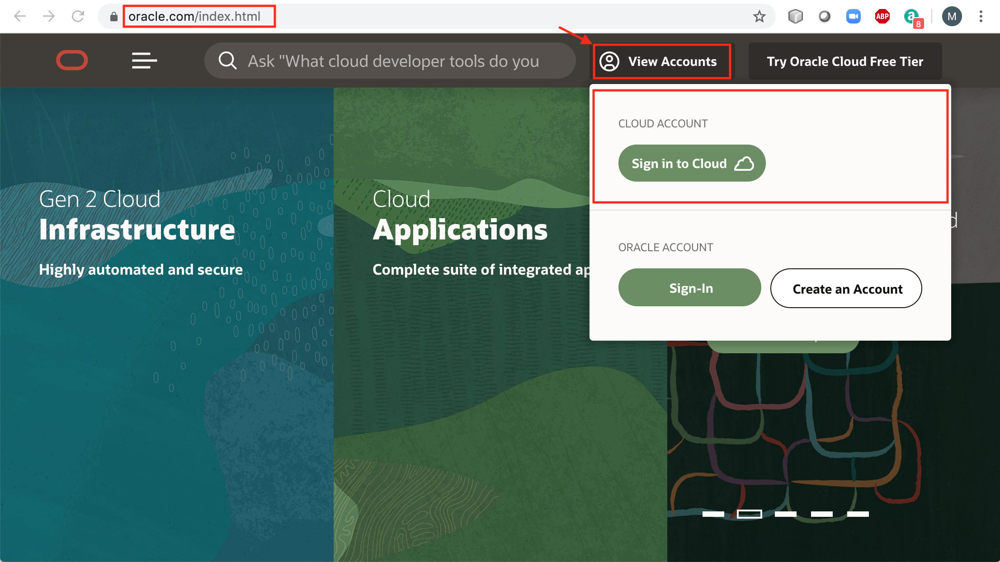

  > **Note :** Oracle Cloud Infrastructure supports the following browsers and versions :
  > * Google Chrome 69 or later
  > * Safari 12.1 or later
  > * Firefox 62 or later

3. Enter the **Account Name** that was chosen during sign up. Click **Next**.

  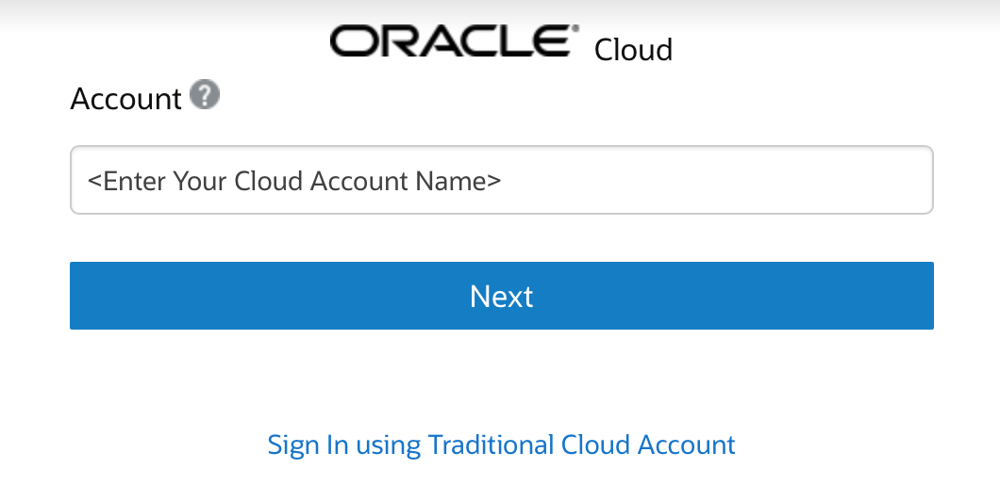

4. Enter the **User Name** and **Password** assigned to you and click **Sign In**.

  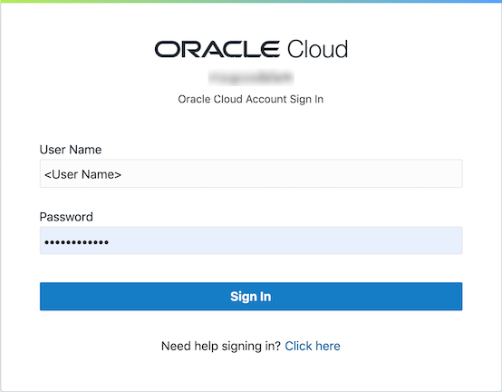

5. You will be taken to **Oracle Cloud Infrastructure** console home page.

  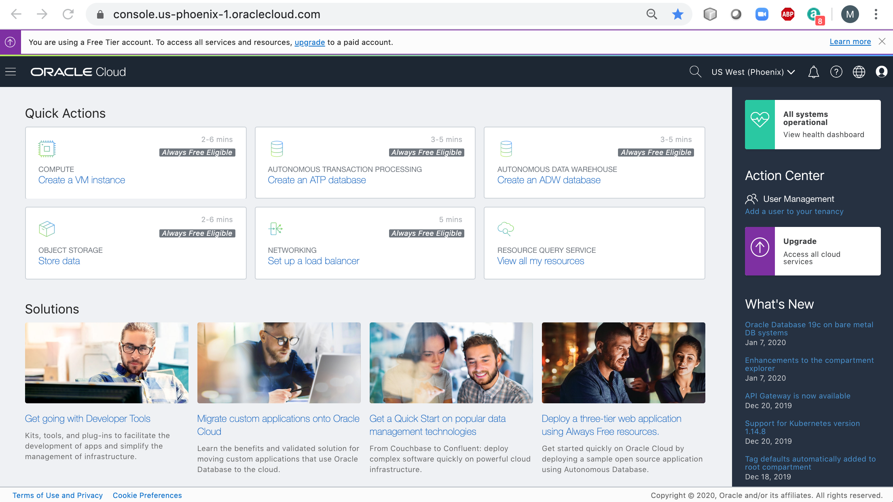

## Locate your Virtual Machine Database

1. From the menu, click on **Bare Metal, VM, and Exadata**.

  

2. Use the Compartment drop down list to select the compartment that contains your database and click on the **Display name** for your database to open the details page..

  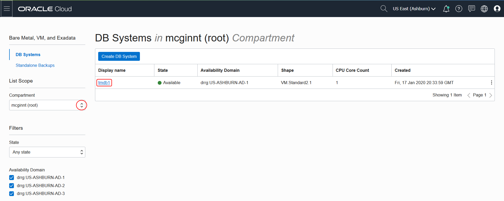

3. Copy the **Host Domain Name** - you'll need this later when you create a connection in SQL Developer.

  

## Add an Ingress rule to open port 1521 to your public IP address

While you can access your database by tunneling over SSH, for the purpose of using the database for development, you can open port 1521 to your public IP address and connect to the database directly.

1. From the DB Systems Details page, click on the **VCN name**.

  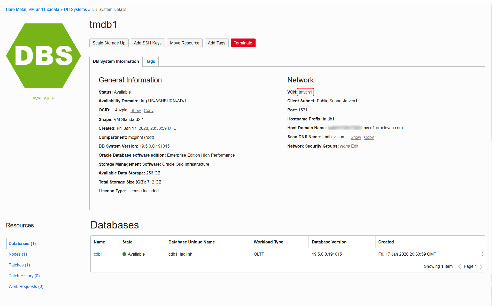

2. On the left menu, click **Security Lists**.

  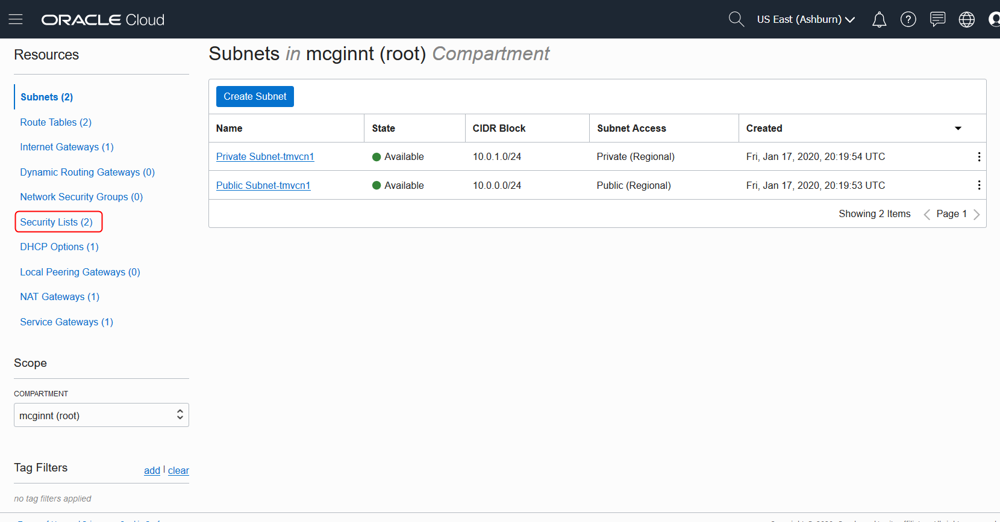

3. Click the link for the **Default Security List**.

  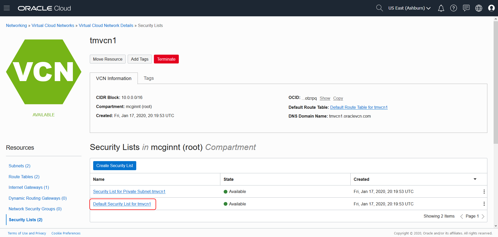

4. Click **Add Ingress Rule**.

  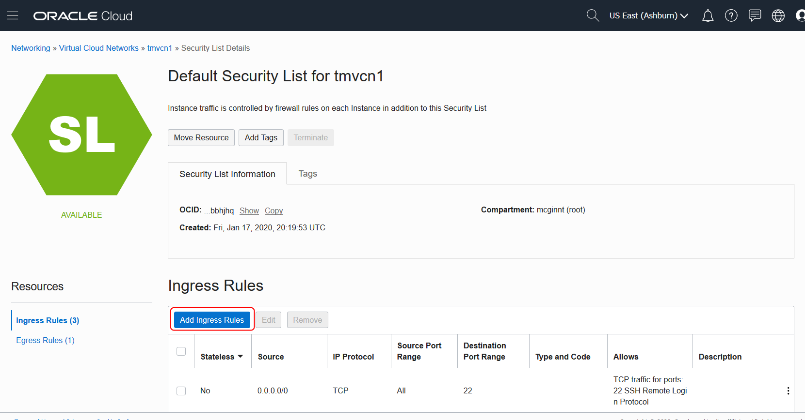

5. Determine your PC's public IP. You may have to ask your internet provider for your public IP address, or type "public IP address" into a Google search.

   **Note:** Your public ip address will change when your connect to a different network, for example, when your sign in to your company's Virtual Private Network (VPN).

6. In the Add Ingress Rules dialog, enter your public IP address, followed by /32. Enter 1521 as the port number (of the database), and click **Add Ingress Rules**.

  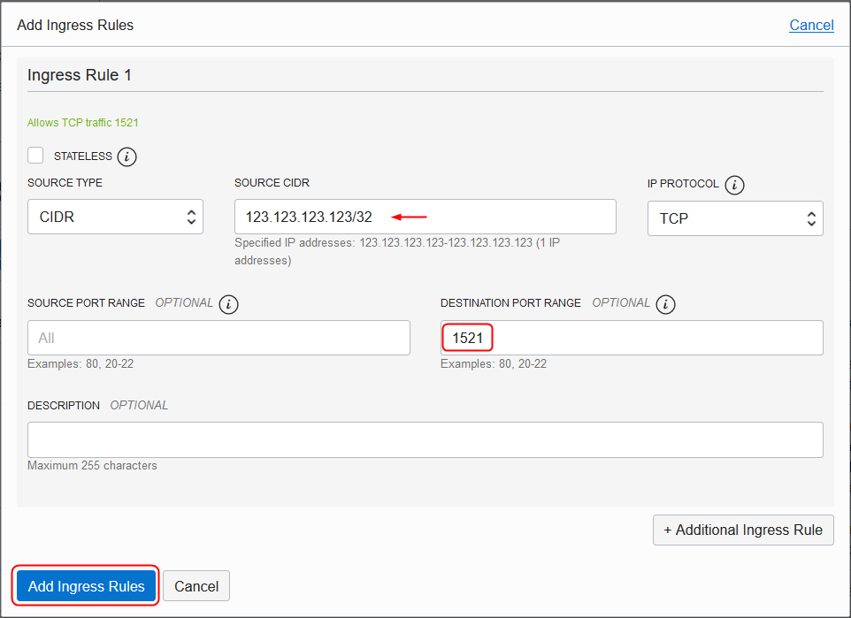

## Create a connection through SQL Developer

1. Launch Oracle SQL Developer and select **New Connection** (the green + sign).

  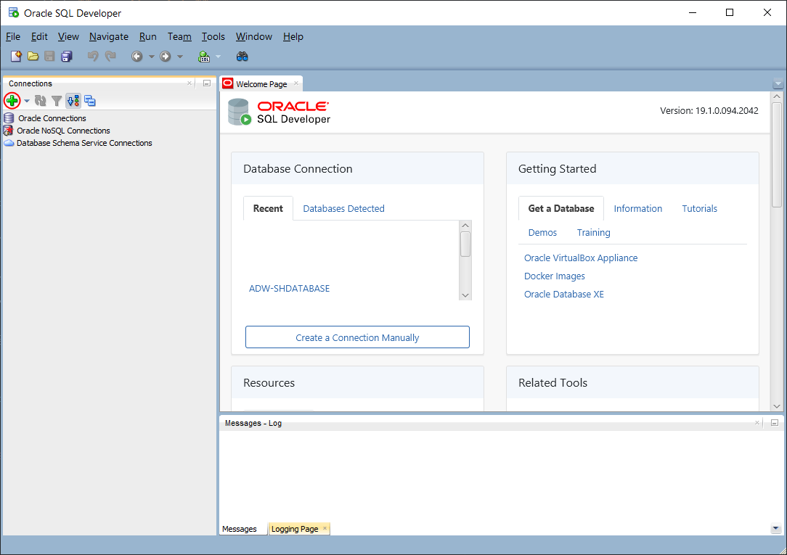

2. In the New / Select Database Connection window, enter the following information:
     * In the **Name** field, enter **PDB1-SYS** as the name of this connection.
     * In the **Username** field, enter **sys**.
     * In the **Password** field, enter the password for the SYS account.
     * Select **SYSDBA** from the **Role** drop down list.
     * Check the **Save Password** checkbox.
     * In the **Hostname** field, enter your Oracle VM Database System's IP address.
     * Click **Service name** and enter **pdb1.** followed by the host domain you copied earlier.

   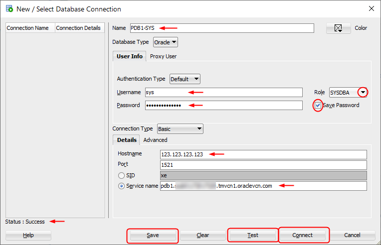

3. Click **Test** to check your connection. You see a Success message in the **Status** field.
4. Click **Save** to save your connection details and then click **Connect**.

5. You now have a connection to your Oracle VM Database system, and you can expand the connection and Tables.

  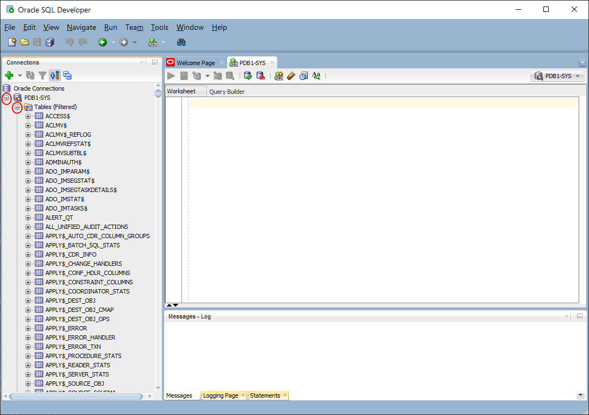

## Want to Learn More?

* [Oracle SQL Developer Documentation](https://docs.oracle.com/en/database/oracle/sql-developer/)
* [Oracle Cloud Infrastructure: Connecting to an DB System](https://docs.cloud.oracle.com/en-us/iaas/Content/Database/Tasks/connectingDB.htm)

## Acknowledgements
* **Author** -Tom McGinn, Learning Architect, Database User Assistance
* **Last Updated By/Date** - Tom McGinn, February 2020

See an issue?  Please open up a request [here](https://github.com/oracle/learning-library/issues).
