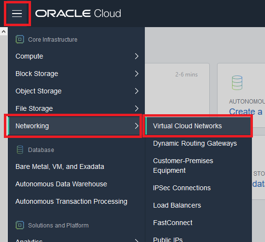
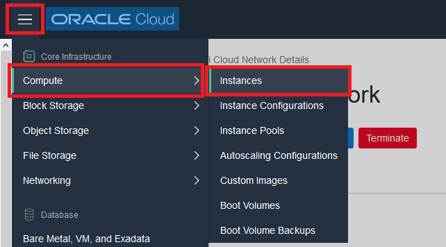

# Create a Virtual Machine Instance Using Oracle Cloud Infrastructure Compute #

## Before You Begin ##
This 20-minute tutorial shows you how to create a Virtual Machine (VM) instance using Oracle Cloud Infrastructure (OCI) Compute Service. Before you can create a VM, you'll create a Virual Cloud Network (VCN).

### Background ###
Oracle Cloud Infrastructure Compute Service lets you create Virtual Machine instances on which you can run your mission-critical applications with high availability.

Before you can launch an instance, you need to have a VCN to launch it into. In the VCN, you launch the instance into a subnet. A subnet is a subdivision of your VCN that you define in a single Availability Domain. The subnet directs traffic according to a route table. Access the instance can be done over the internet using its public IP address, so your route table will direct traffic to an Internet Gateway. The subnet also uses a security list to control traffic in and out of the instance.

### What Do You Need? ###
* Access to an instance of Oracle Cloud Infrastructure Compute Service
* A VCN in the compartment in which the instance will run
* An SSH key (provided)

## STEP 1: Create a Virtual Cloud Network ##
1. Sign in to the Oracle Cloud.
2. Click the menu icon to expand the menu on the left edge of the screen.
3. Select **Networking**.
4. Click **Virtual Cloud Networks**.
    
    

    [Description of the illustration OCIMenu1.png](files/OCIMenu1.txt)

5. Select the **root** compartment from the Compartment dropdown menu.

    

    [Description of the illustration Compartment.png](files/Compartment.txt)

6. Click the button **Create Virtual Cloud Network**.
7. In the Create Virtual Cloud Network dialog box, enter the following information:
     * **Name**: `user01_Network`
     * **Create in Compartment**: Select the root compartment.
     * Select **Create Virtual Cloud Network Plus Related Resources**.
     * Ensure the box to **Use DNS Host Names in this VCN** is checked.
     * Scroll down. The box to **View detail page after this resource is created** should also be checked.
8. Click the button **Create Virtual Cloud Network**. The dialog box then confirms the details of the VCN.
9. Click **Close**. 
     * You should be taken to a page detailing your new VCN.
     * Notice its state is `Available`.

## STEP 2: Create a Virtual Machine Instance ##
1. Click the OCI menu icon to expand the menu on the left edge of the screen.
2. Select **Compute**.
3. Click **Instances**.
    
    

    [Description of the illustration OCIMenu2.png](files/OCIMenu2.txt)

4. Ensure the **root** compartment is still selected in the Compartment dropdown menu.

    

    [Description of the illustration Compartment.png](files/Compartment.txt)

5. Click the button **Create Instance**.
6. On the Create Compute Instance page, enter the following information:
     * **Name**: Keep the default value.
     * **Operating System**: `Oracle Linux 7.7` (Or the latest Oracle Linux).
     * **Availability Domain**: Keep the default value.
     * **Instance Type**: `Virtual Machine`
     * **Instance Shape**: `VM.Standard2.1 (1 Core OCPU, 15 GB Memory)`
     * **Configure Networking**: Ensure your VCN compartment is set to **root** and VCN set to what you created earlier, `user01_Network`. Keep the default values for the remaining fields.
     * **Boot Volume**: Keep the default values. The boxes should remain unchecked.
     * **Add SSH Key**: Select `Paste SSH Keys`. An example SSH key you can paste is: 
     <pre><code>ssh-rsa AAAAB3NzaC1yc2EAAAADAQABAAABAQDVNPh09u35ejTZun3FNEGhrjL/CovPsHAh79pN0QVprxEJaW2zjmaBZF1Q6lkuyTRvraomIlduCYxrlnwCe8oyER5dY1zuJATWm7ZiqgsvIkhj8L+ea9dBZRvFvcnFsNFnt4ALZYkW2nB2EeTdvqVMHERjFKfbRMCcO0dusmBUEsvaaqLtrvVuHBjwoXIDKkT/PFkix4DWRZRkZIjmZ/y9kwrHO4W1FYsFi4LP1xIB1c9y2H4w0SBXAMv4NCSFEIgWPQly2NywMsgEbddjW+zPz+7YjYqjWfz5Fgchu7+N1gejsIdzg1/aLvDpze6TN9xLcZx5gt04jA3TR+xfs2Ab Tim@Corsair</code></pre>
         
    

    [Description of the illustration pastesshkey.png](files/pastesshkey.txt)

7. Click **Create** at the bottom of the page.
     * While the instance is being created, its status displays as `PROVISIONING`.
     * The status changes to `RUNNING` when the instance is fully operational.

## Want to Learn More? ##
* [Oracle Cloud Infrastructure Training](https://education.oracle.com/learn/iaas/pPillar_640) from Oracle University 
* [Oracle Cloud Infrastructure 2018 Architect Associate Certification](https://education.oracle.com/es/oracle-cloud-infrastructure-2018-architect-associate/pexam_1Z0-932) from Oracle University