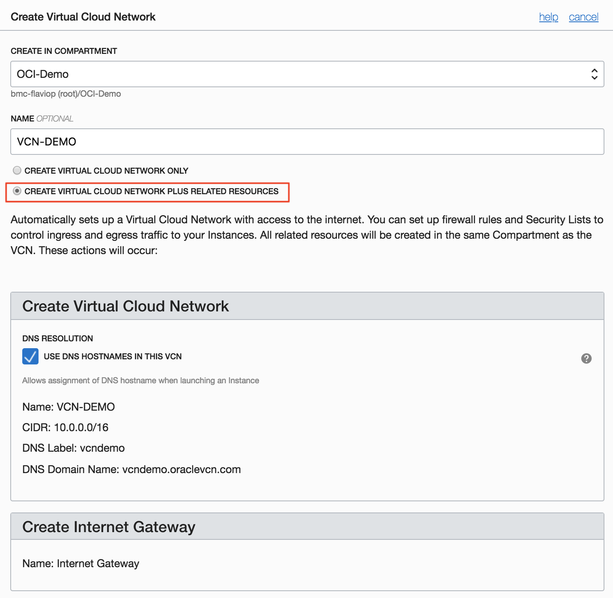
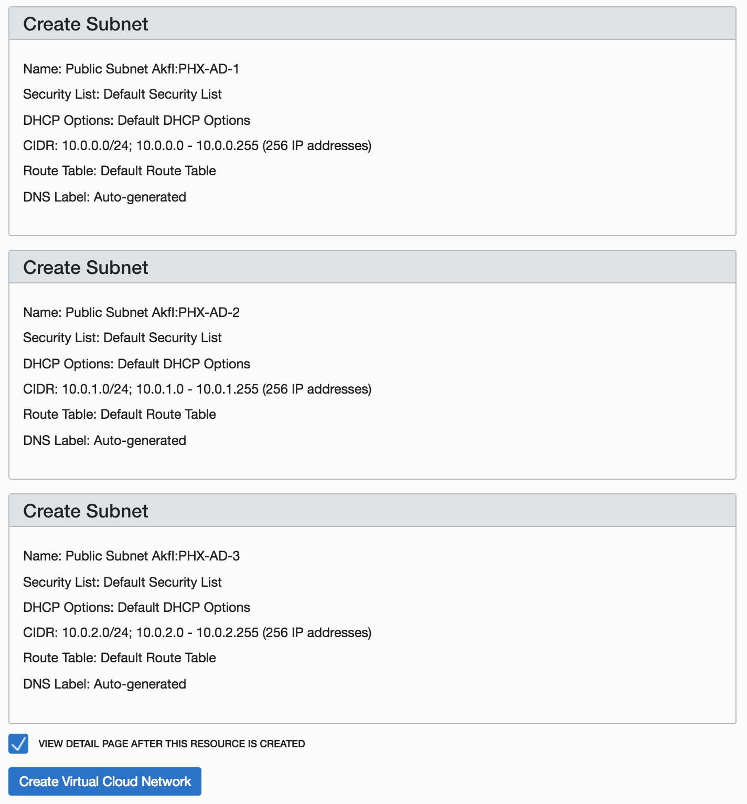
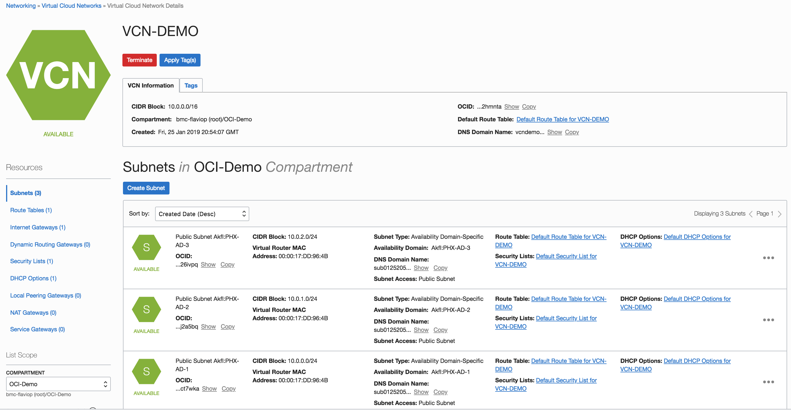

# Virtual Cloud Network - VCN

<!-- comment out table of contents>  

## Table of Contents

[Overview](#overview)

[Pre-Requisites](#pre-requisites)

[Practice 1: Create a Virtual Cloud Network](#practice-1-create-a-virtual-cloud-network)

-->

## Overview

When you work with Oracle Cloud Infrastructure, one of the first steps is to set up a virtual cloud network (VCN) for your cloud resources. This topic gives you an overview of Oracle Cloud Infrastructure Networking components and typical scenarios for using a VCN.

**Note:** *Some of the UIs might look a little different than the screen shots included in the instructions, but you can still use the instructions to complete the hands-on labs.*

## Pre-Requisites 

- Oracle Cloud Infrastructure account credentials (User, Password, and Tenant) 
  - To sign in to the Console, you need the following:
  -  Tenant, User name and Password
  -  URL for the Console: [https://console.us-ashburn-1.oraclecloud.com/](https://console.us-ashburn-1.oraclecloud.com/)
  -  Oracle Cloud Infrastructure supports the latest versions of Google Chrome, Firefox and Internet Explorer 11 

## Practice 1: Create a Virtual Cloud Network

A Virtual Cloud Network (VCN) is a virtual version of a traditional network including subnets, route tables, and gateways on which your compute instances run. Customers can bring their network topology to the cloud with VCN. Creating a VCN involves a few key aspects such as:

 - Allocate a private IP block for the VCN (CIDR range for the VCN).
 - Customers can bring their own RFC1918 IP addresses.
 - Create Subnets by partitioning the CIDR range into smaller networks (sub networks for front end, back end, database)
 - Create an optional Internet Gateway to connect VCN subnet with Internet. Instances created in this subnet will have a public IP address.
 - Create Route table with route rules for Internet access
 - Create Security List to allow relevant ports for ingress and egress access

1. Create a Virtual Cloud Network with Public Subnets:

   - One public subnet per Availability Domain
   - An Internet Gateway
   - A corresponding route rule in the default route table
   - The default security list
   - The default set of DHCP options

    **Note:** You can launch one or more compute instances in a subnet. Each instance gets both a public and private IP address. The launch instance dialog now has a check box for choosing whether the instance has a public IP address. You can communicate with the instances over the Internet via the public IP address from your on-premises network.

2. Open the Console and in Menu, click **Networking**.

3. Select a compartment on the left that you have permission to work in.

    

4. Click **Create Virtual Cloud Network** and enter the following details:

   - **Create in Compartment:** This field defaults to the currently selected compartment. Select the compartment you want to create the VCN in, if not already selected.
   - **Name:** Enter a name for your cloud network (for example, VCN-DEMO).

    **Note:** Enter a friendly name for the cloud network. It doesn't have  to be unique, and it cannot be changed later in the Console.

5. Select **Create Virtual Cloud Network plus related resources**. The dialog box expands to list the items that will be created with your cloud network.

    **Note:** This option is the quickest way to get a working cloud network in the fewest steps.

    

6. Scroll to the bottom of the dialog box and click **Create Virtual Cloud Network**.

    

    A confirmation page displays the details of the cloud network that you just created.

    The Virtual Cloud Network above has the following resources and characteristics:

     - CIDR block range of 10.0.0.0/16
     - An Internet Gateway
     - A route table with a default route rule to enable traffic between VCN and the Internet Gateway
     - A default security list that allows specific ingress traffic to and all egress traffic from the instance
     - A public subnet in each Availability Domain
     - The VCN will automatically use the Internet and VCN Resolver for DNS

7. Check the details of your VCN and you will see all the resources created:
   
   

[Back to top](#overview)