# NAT Gateway Lab

<!--  Comment out table of contents

## Table of Contents

[Overview](#overview)

[Pre-Requisites](#pre-requisites)

[Practice 1: Creating Virtual Cloud Network with Public and Private Subnets](#practice-1-creating-virtual-cloud-networks-with-public-and-private-subnets)

[Practice 2: Create Instances](#practice-2-create-instances)

[Practice 3: Configuring NAT Gateway](#practice-3-configuring-nat-gateway)

[Summary](#summary)

-->

## Overview

Oracle Cloud Infrastructure allows you to create Virtual Cloud Networks (VCN) which functions as an extended datacenter in the cloud. The virtual networking primitives offered by the platform give you full flexibility to build a network that meets complex enterprise requirements.  You can use any address range for your VCN, divide it into subnets, configure security lists, and create route tables. You can connect your VCN to your on-premises network through a Dynamic Routing Gateway (DRG) through IPSec connections over the Internet or through FastConnect which enables private, dedicated connections.

One of the most common network design requirements is to secure private instances from being accessible from the Internet, while being accessible only from the on-premises network or bastion hosts in public subnets. You can achieve this by launching the instances in a private subnet or by choosing to not assign a public IP address at launch. However, these backend instances may need access to the Internet for specific purposes like software updates or CRL verification. You may choose to route this traffic to your on-premises network through your Internet gateway, but that may add unwanted latency or cost.

With the recent enhancements on our virtual networking platform, you can now enable outbound Internet access from your private instances using a new feature called NAT Gateway. A NAT gateway allows cloud resources without public IP addresses access to the internet without exposing those resources to incoming internet connections.

In this lab you will create a VCN with public and private subnets.  You will create an internet gateway, route tables, and a security list.  You will create two instances, one to use as a bastion host, and the other as a private instance.  You will create a NAT gateway to allow the private instance to access the public internet.

## Pre-requisites

- Oracle Cloud Infrastructure account credentials (User, Password, and Tenant)
- Access to Oracle Cloud Infrastructure account

## Practice 1: Creating a Virtual Cloud Network with Public and Private Subnets

In this exercise, you will create a VCN and its required resources.

1. In the web console, use the menu and select **Networking -> Virtual Cloud Networks**. 
2. Click **Create Virtual Cloud Network**.


3. In the dialog box, choose your compartment, and name your VCN **TrainingVCN**.  Select **Create Virtual Cloud Network Only**

4. Choose a CIDR block - 10.0.0.0/16.  Keep the remaining options as defaults

5. Click - **Create Virtual Cloud Network**.  This creates a VCN.  You will see the details page of the created VCN.


Within this VCN, we will now create additional resources. 

6. Navigate to **Internet Gateways** on left side panel, and click on **Create Internet Gateway**. Provide a name and click **Create Internet Gateway**. 

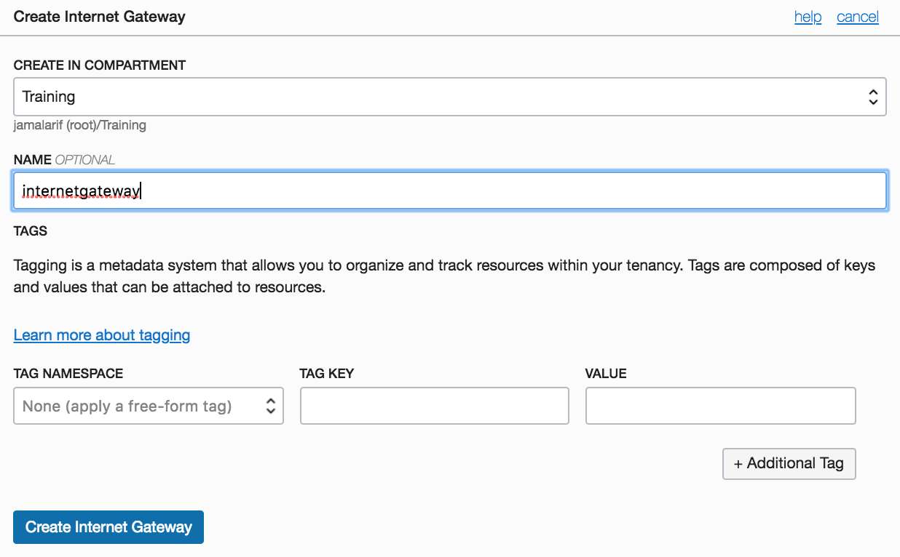

7. Navigate to Route tables and create a route table for private subnets. We will attach this route table to private instances in the private subnet. 
	
8. Click **Create Route table** Don’t add any rules to it for now, we will add them later.

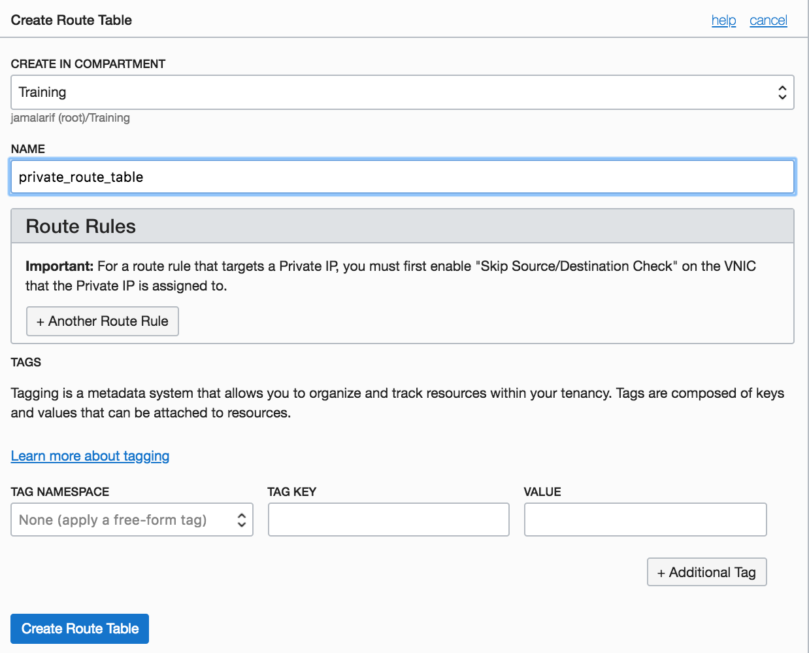

An empty route will automatically appear in the UI. You may ignore  it, or click the red X to remove it.

9. Navigate to Security Lists on the left panel. And Create a Security lists for Private subnets. Click on **Create Security List**, choose your compartment and name the list `private_security_list`.   Remove all ingress and egress rules for now. We will add them later.  
10. Click on the **Create Security List** button.


11. Navigate back to subnets and create two subnets. One subnet will be a public subnet which will host our Bastion Host and have access to the internet. The second subnet will be Private subnet and will host the private instances.

<!-- This is where I left off editing -->

12. Create a Private Subnet using the information in the below table.

| Field      |  Entry           |
| -----------|------------------|
| Name:      |  Private Subnet  |
| Availability Domain: | Choose one  |
| CIDR Block:          | 10.0.10.0/24 |
| Route Table:         | Private Route Table |
| Subnet:			   | Private Subnet 	 |
| DHCP Options:		   | Default DHCP options |
| Security List:	   | Private Security List |

<!-- comment out the list
  - Name: Private_Subnet
  - Availability Domain: \<Choose anyone among the three\>
  - CIDR Block: 10.0.10.0/24
  - Route table: **Private Route table**
  - Subnet : Private Subnet
  - DHCP Options : Default Dhcp options
  - Security List: **PrivateSecurityList**
  -->

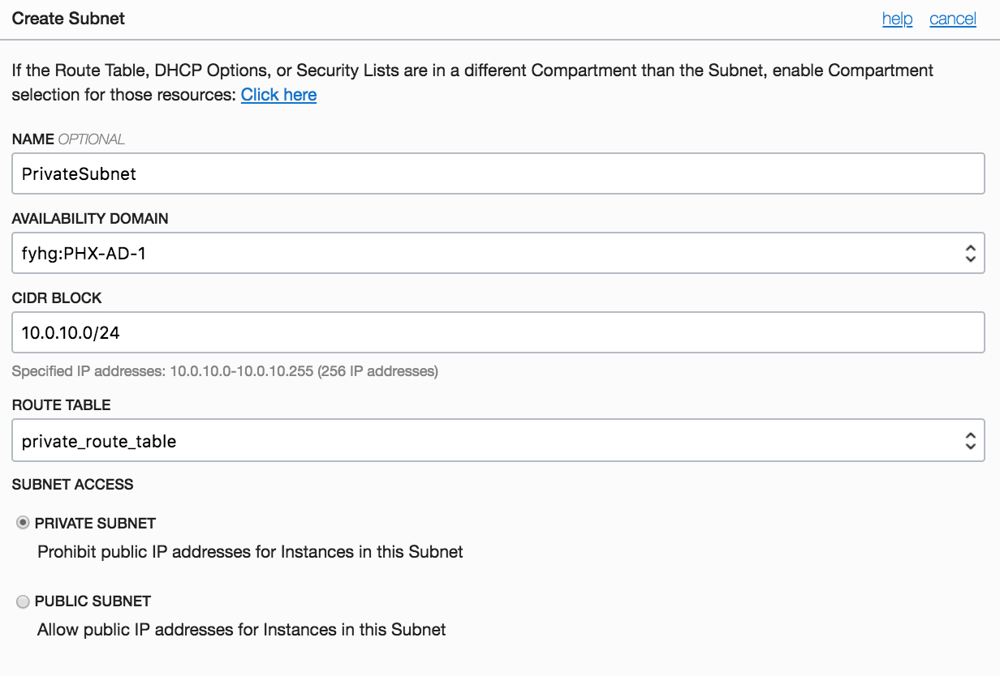


13. Create a Public Subnet using the information in the table below.

| Field      |  Entry           |
| -----------|------------------|
| Name: | Choose one |
|Availability Domain: | Choose one |
|CIDR Block: |10.0.20.0/24|
| Route table: | Default Route table |
| Subnet: | Public Subnet |
| DHCP Options: | Default DHCP options |
| Security List: | Default Security List |


Your subnets should look like the below image. 


So far, you have created a VCN, a public subnet, and a private subnet. Each subnet is associated with route table and a security list.  Next we will add route table rules in the default route table, edit the security list in the private subnet and create instances in each one of the subnet, and connect with them.

Navigate to **Route tables** section of your VCN and add a route table rule in the Default Route Table.

14. Click on **Default Route Table** and choose **Edit**.  Enter the following information.

| Field      |  Entry           |
| -----------|------------------|
| Target Type: |Internet Gateway |
| Compartment: |Your compartment name |
|Destination CIDR:|  0.0.0.0/0  |
| Target Internet Gateway: | Your internet gateway name |
	


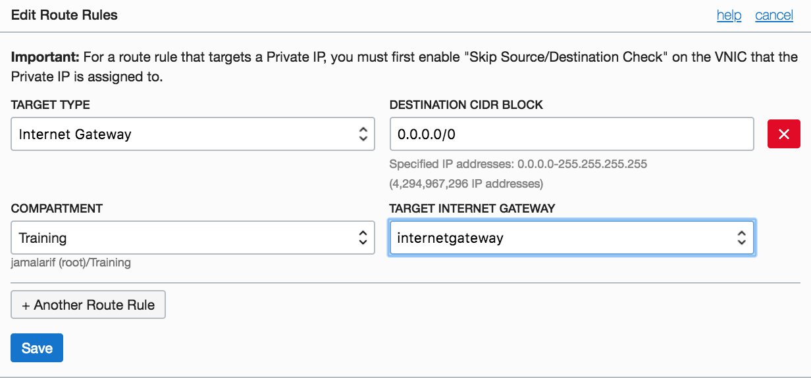

15. Navigate to **Security Lists** of your VCN and edit the private security lis. This is the security list that's associated with your private subnets only. 

16. Click on **Private Security List** and Click on **Edit All Rules**. Add the following rules. And **Save** them! 

**Ingress**
| Field      |  Entry           |
| -----------|------------------|
|Source CIDR: |10.0.20.0/24|
|Source Type: |CIDR|
|Protocols: | All Protocols|

**Egress**
| Field      |  Entry           |
| -----------|------------------|
| Destination CIDR: |0.0.0.0/0|
|Source Type: |CIDR|
|Protocols: |All Protocols|
		


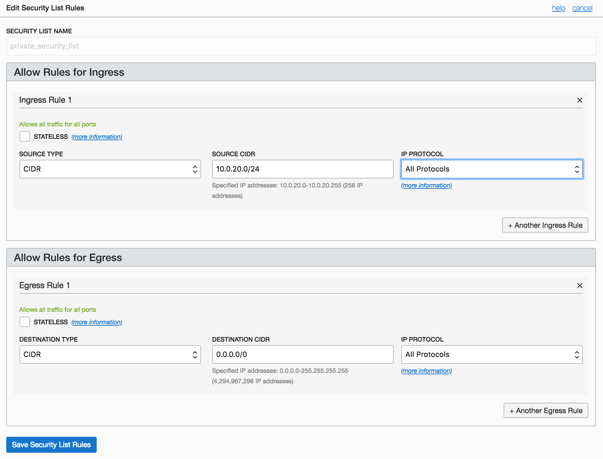
	
You have updated the security list of your private subnet to allow only ingress traffic from the public subnet. 

## Practice 2: Create Instances 

In this practice, you create instances in each of the two subnets in our VCN. 

1. Navigate to the **MENU**  --> **Compute** --> **Instances**. Click on **Create Instance**.  Enter the information from the table below.

| Field      |  Entry           |
| -----------|------------------|
|Name: |Bastion Host|
|Availability Domain: |Choose an AD |
|Operation System: |Default Oracle Linux |
|Instance Type: |Virtual Machine|
|Instance Shape: |VM.Standard2.1 |
|Boot Volume: |46 GB (Default) |
|SSH key: | Upload or paste your SSH key |
|Virtual Cloud Network: |TrainingVCN |
|Subnet: |Your Public Subnet Name |

2. Click **Create** and wait a moment for the compute create confirmation.

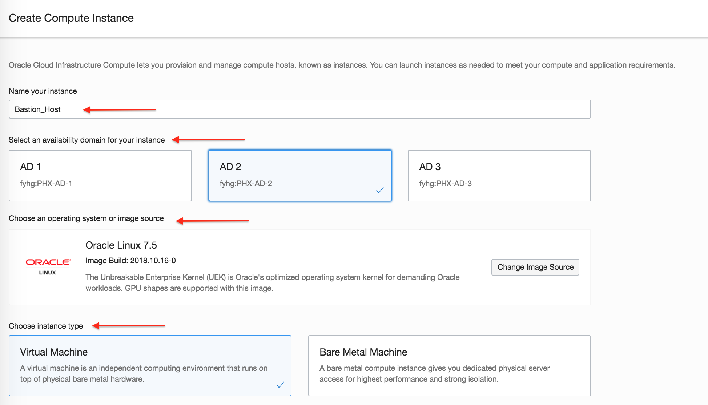
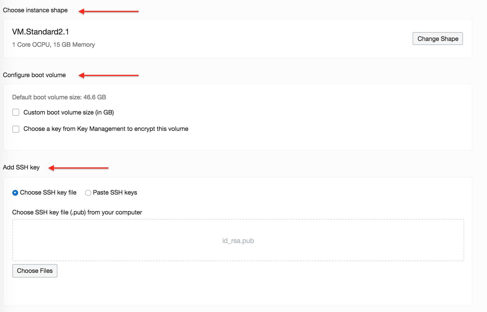
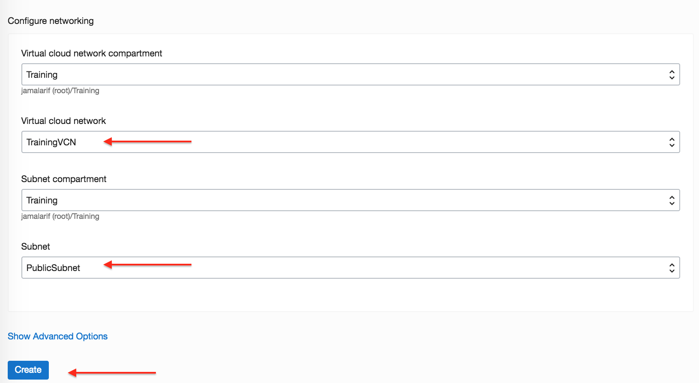

The confirmation page will show the detail of your Public Instance. Note or copy the Public IP address. We will need the public IP to access the instance via SSH. 

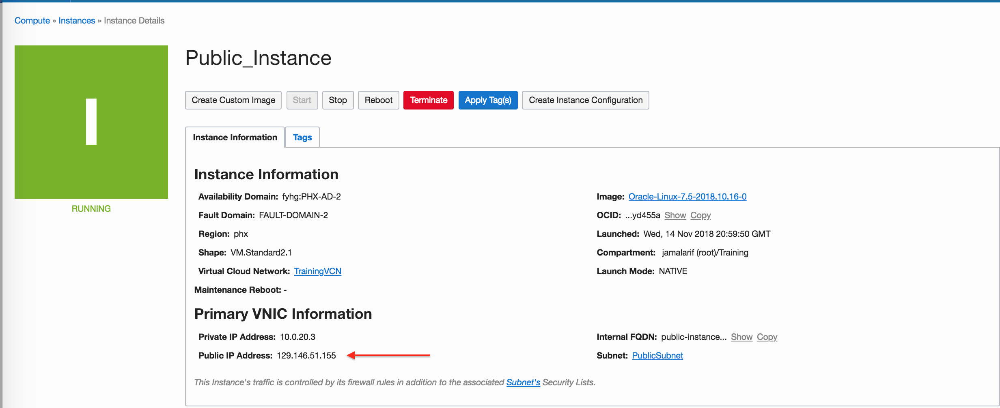

3. Create a private instance. Navigate to the **MENU**  --> **Compute** --> **Instances**. Click on **Create Instance**.  Enter the information from the table below.
		
| Field      |  Entry           |
| -----------|------------------|
|Name: |Private_Instance|
|Availability Domain:| Choose an AD|
|Operation System: |Default Oracle Linux|
|Instance Type: |Virtual Machine|
|Instance Shape: |VM.Standard2.1 |
|Boot Volume:|46 GB (Default) |
|SSH key: | Upload or paste your SSH key |
|Virtual Cloud Network: |TrainingVCN |
|Subnet: |Your Private Subnet Name |

4. Click **Create**. 

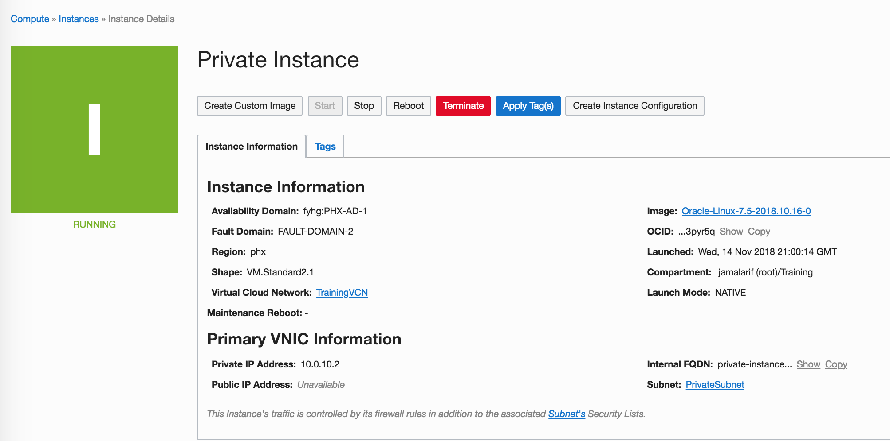

The confirmation page will show the details of the Private Instance. Copy or note the Private IP address of this instance.   We will use the private IP to ssh into the instance via our bastion host (public instance). 

NOTE: For following steps ***MacOS/Linux:*** use a bash terminal and for ***Windows:*** the example uses GitBash

3. Lets connect to the instances that we launched. Let’s first ssh into our **Bastion Host** Since the instance is in a **public subnet**, and has a public IP address we can directly ssh into it with the same ssh keys we used to launch it. The default username is **opc**

```
ssh -i /pathtosshprivatekey/ opc@<Public IP of Bastion Host>
```


We need to connect to the **private instance** and use it to check internet connectivity. Since the instance has been launched in a private subnet and doesn’t have a public IP address, we can’t SSH directly into the instance.  However, we can SSH into the private instance from the Public instance which is in the public subnet.
In Order to SSH into a private instance we will use the SSH proxy command. This command allows us to “tunnel” through the bastion host to our private instance, while maintaining SSH keys locally on our laptop. Storing private SSH keys on a public server such as a Bastion host is not recommended.

4. Enter the following command in from the bastion host.

```
$ ssh -t -o ProxyCommand='ssh -i /<path_to_ssh_privatekey>/ opc@<Bastion_Host_Public IP> -W %h:%p %r' -i /<path_to_ssh_privatekey>/ opc@<Private Instance IP>  
```


You are now connected to the Private instance and the bastion host. The bastion host is part of the public subnet and is connected to internet via the internet gateway. The Private instance is in a private subnet, with no public IP or public internet access. You can confirm access as show below. 


## Practice 3: Configuring NAT Gateway

In this exercise, we are going to configure a NAT Gateway in our VCN. After configuring the NAT Gateway, we will modify the route table for our private subnet so that private instances can now access the internet via this NAT Gateway. 

1.  Navigate to the **MENU**  --> **Networking** --> **Virtual Cloud Network**. Click on **Training VCN** 

2. Inside your VCN, click on **NAT Gateway** --> **Create Nat Gateway**. 

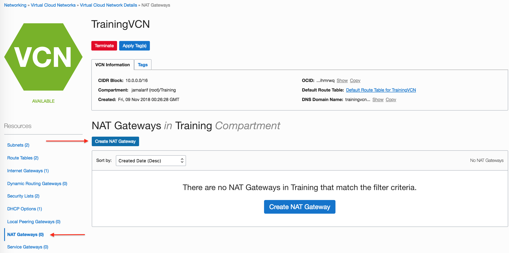
		
3. Provide a Name for Nat Gateway device and click **Create**
4. Close the dialog box

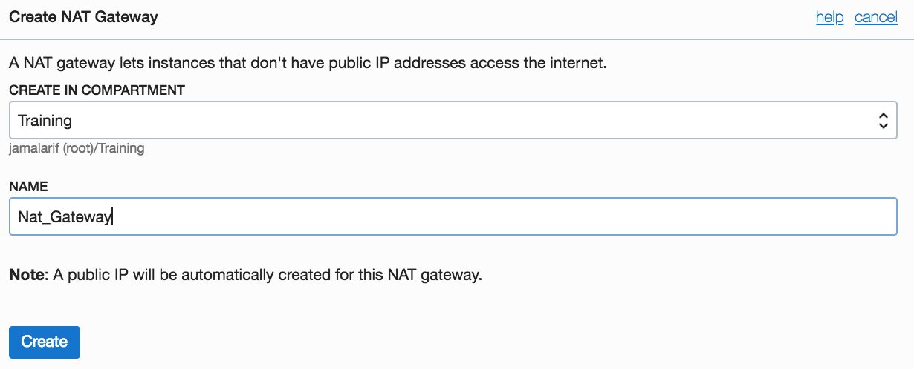


    
5. Navigate to  **Route tables** --> **Private route table** --> ** Edit Route Rule**   Click to Add Another Route Rule and enter the following information.

| Field      |  Entry           |
| -----------|------------------|
|Target Type: |Nat Gateway|
|Destination CIDR: |0.0.0.0/0|
|Compartment: | Your Compartment |
|Target Type Name: | Nat Gateway	|

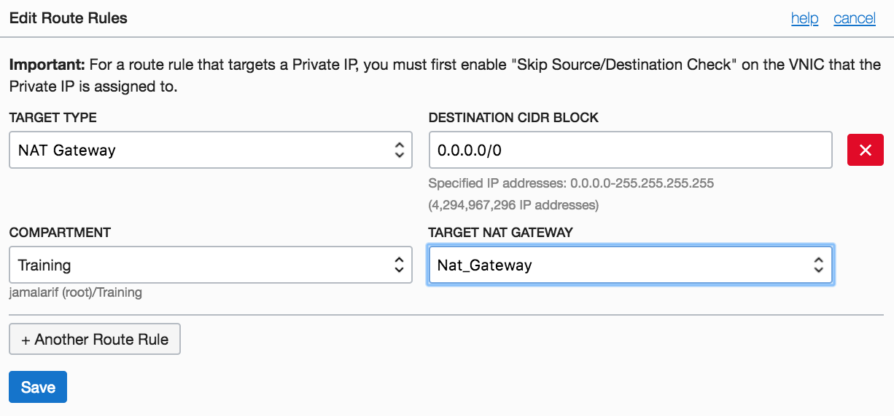

This route rule will send all the traffic from the private subnet to NAT Gateway.  A NAT gateway gives your private instance access to the internet without exposing it to incoming internet connections.

6. While still logged in the Private instance, test internet connectivity with the ping command. As you can see below, you have connectivity via the NAT Gateway device. 


## Summary

In this lab, you created a private instance with internet access for updates and patching.  The private instance didn't have a public IP address and could not receive inbound connections from the internet to keep them secure.  

[Back to top](#overview)